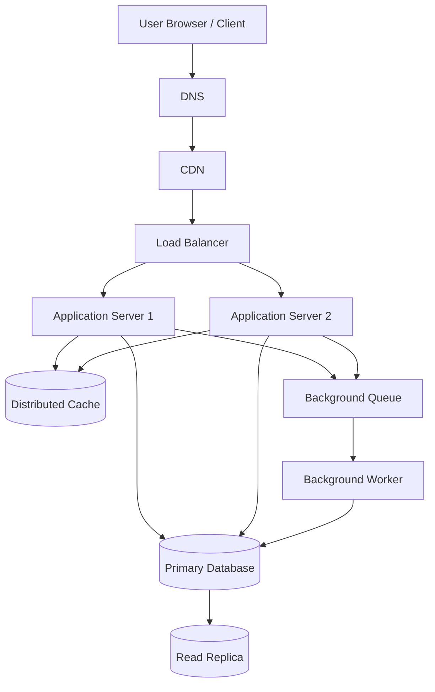

# QuickNotes System Architecture

## 1. Overview

QuickNotes is a web-based note-taking service designed to support one million registered users. The system must provide reliable note creation, retrieval, updating, deletion, and tag management. The proposed architecture separates the frontend, application services, caching, database storage, and background processing.

## 2. Functional Requirements

1. Users can register and log in securely.
2. Users can create notes with a required title of up to 100 characters and an optional body.
3. Users can list, view, update, and delete their own notes.
4. Users can create tags and associate multiple tags with notes.
5. Users can search and paginate through their notes.
6. The system returns meaningful success and error responses.
7. Users cannot access another user's private notes.

## 3. Non-Functional Requirements

* **Scalability:** Support one million registered users and allow application servers to scale horizontally.
* **Availability:** Target 99.9% monthly service availability.
* **Performance:** Aim for a p95 response time below 300 ms for common cached reads under normal load.
* **Security:** Use HTTPS, authentication, authorization, input validation, and secure password hashing.
* **Reliability:** Use database backups, replication, health checks, and automated recovery procedures.
* **Consistency:** Commit writes to the primary database before reporting them as successful.
* **Maintainability:** Keep application services modular, monitored, tested, and documented.
* **Data protection:** Restrict access to private notes and define backup retention and deletion policies.

## 4. Load Estimates for One Million Users

These estimates are planning assumptions, not measured production traffic.

Assume:

* 1,000,000 registered users.
* 10% of users are active daily: 100,000 daily active users.
* Each daily active user performs 100 read requests and 10 write requests per day.
* A stored note averages 2 KB, including its text and estimated metadata.
* Each daily active user creates 2 new notes per day.
* The service operates continuously for 86,400 seconds per day.

### Reads per second

Daily reads:

100,000 × 100 = 10,000,000 reads/day

Average reads per second:

10,000,000 ÷ 86,400 ≈ 116 reads/second

For planning, allow for traffic peaks of approximately 10 times the average, or around 1,160 reads/second.

### Writes per second

Daily writes:

100,000 × 10 = 1,000,000 writes/day

Average writes per second:

1,000,000 ÷ 86,400 ≈ 12 writes/second

A 10-times peak is approximately 120 writes/second.

### Storage per year

Assume each daily active user creates two new notes per day.

Annual notes:

100,000 × 2 × 365 = 73,000,000 notes/year

At approximately 2 KB per note:

73,000,000 × 2 KB = 146 GB/year of raw note data.

Allowing roughly 2 times additional space for indexes, metadata, and database overhead gives approximately 292 GB/year. Replicas and backups require additional storage.

These estimates exclude detailed audit logs, images, and other future attachments. Storage must be reviewed using actual production measurements.

## 5. Architecture Diagram

The following diagram shows the proposed logical architecture.

The diagram represents logical request paths. Static frontend assets can be served by the CDN, while API requests are routed through the load balancer to the application servers.

## 6. Component Responsibilities

| Component            | Problem it solves                                                                      |
| -------------------- | -------------------------------------------------------------------------------------- |
| Client               | Provides the interface for creating, viewing, and managing notes.                      |
| DNS                  | Resolves the service domain to its network endpoint.                                   |
| CDN                  | Delivers static assets from nearby locations and reduces origin traffic.               |
| Load balancer        | Distributes requests across healthy application servers.                               |
| Application Server 1 | Processes API requests and applies business rules.                                     |
| Application Server 2 | Adds capacity and allows requests to continue if one server fails.                     |
| Distributed cache    | Speeds up frequently requested data and reduces repeated database reads.               |
| Primary database     | Stores authoritative user, note, tag, and relationship records.                        |
| Read replica         | Serves eligible read queries and reduces load on the primary database.                 |
| Background queue     | Holds asynchronous jobs so temporary worker delays do not block API requests.          |
| Background worker    | Processes queued work such as notifications, cleanup, and other non-interactive tasks. |

The application servers are stateless so requests can be routed to either server without relying on local session storage.

## 7. GET /notes Request Flow

1. The user opens QuickNotes and requests their notes.
2. DNS resolves the service domain, and the browser obtains frontend assets from the CDN when available.
3. The API request travels through the load balancer to a healthy application server.
4. The server validates the user's authentication token and authorization.
5. The application checks the distributed cache using a key that includes the authenticated user's identity and pagination parameters.
6. On a cache hit, the server returns the cached notes after confirming access rules.
7. On a cache miss, the server reads the notes from the read replica when replication freshness is sufficient; otherwise, it reads from the primary database.
8. The application caches the result with a suitable expiration time.
9. The server returns a paginated JSON response with HTTP `200 OK`.
10. If no notes exist, the response contains an empty data array and a valid pagination object.

Cache keys must be scoped by user. This prevents one user from receiving another user's private notes.

## 8. POST /notes Request Flow

1. The user submits the note form.
2. The request passes through DNS resolution, the CDN/API routing layer, and the load balancer to a healthy application server.
3. The application validates authentication, authorization, and the request body.
4. The application verifies that the title is present and does not exceed 100 characters.
5. The application starts a database transaction and inserts the note into the primary database.
6. The database commits the transaction and returns the new note ID and timestamps.
7. The application invalidates or updates relevant cached note lists.
8. If follow-up work is required, such as sending a notification, the application records a job in a durable queue. A transactional outbox can be used to prevent committed writes from losing their associated events.
9. The API returns `201 Created` with the newly created note in JSON.
10. The worker processes queued background work independently of the user's request.

The service must not return a successful creation response until the database has committed the note.

## 9. Trade-Offs

### Trade-off 1: Cache speed versus data freshness

Caching makes frequent reads faster and reduces database load. However, cached data can become stale after a note is updated or deleted. QuickNotes will invalidate relevant cache entries after writes, use short expiration times, and read from the primary database for operations that require immediate consistency.

### Trade-off 2: Read replicas versus consistency

Read replicas allow the system to serve more reads without overloading the primary database. However, replication lag can cause a recently created note to be temporarily missing from a replica. The service will use the primary database for read-after-write operations and replica reads for requests that can tolerate small delays.

### Trade-off 3: Asynchronous processing versus operational complexity

A queue prevents slow background work from delaying normal API responses. It introduces additional components and possible duplicate job delivery. Workers will use retries with backoff, idempotent processing, dead-letter handling, and queue monitoring.

### Trade-off 4: Horizontal scaling versus state management

Adding application servers increases request capacity and improves resilience, but shared state must not live only on one server. Authentication state, cache data, and jobs will use shared services, while application servers remain replaceable and stateless.

## 10. Avoiding Single Points of Failure

* **Application servers:** Run at least two instances across separate availability zones and use load-balancer health checks.
* **Load balancer:** Use a managed or redundant load-balancing service with health monitoring.
* **Cache:** Use a replicated cache service with failover; allow requests to fall back to the database when safe.
* **Primary database:** Configure automated backups, point-in-time recovery, and a tested failover process to promote a replica when required.
* **Read replica:** Monitor replication lag and route reads to the primary database when necessary.
* **Queue and workers:** Use a durable, replicated queue and multiple worker instances.
* **DNS and CDN:** Use a reliable managed DNS provider and a CDN with redundant edge infrastructure.
* **Monitoring:** Alert on errors, latency, replication lag, queue backlog, resource exhaustion, and failed health checks.

Replication alone does not guarantee zero downtime or zero data loss. Failover procedures must be tested, and recovery objectives must be defined.

## 11. Monitoring and Future Improvements

The team should measure request rate, p95 and p99 latency, error rates, cache hit ratio, database connection usage, replication lag, queue age, and storage growth.

As usage increases, the team can introduce database partitioning where justified by measured bottlenecks, optimize search, and add object storage if image or file attachments are introduced. Scaling decisions should be based on real usage rather than assumptions alone.
